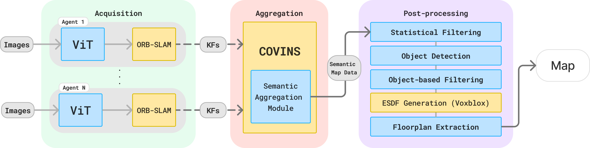

# Semantic COVINS

Semantic COVINS is a SLAM system performing collaborative visual-inertial localization and mapping with enhanced human-readability. Main contributions fall into three parts: 



System diagram. Yellow - existing blocks and packages; blue - newly introduced blocks. 

# Acquisition

Here we have our visual transformer and ORB-SLAM running on every agent. 

The model I chose is [EfficientVIT](https://github.com/mit-han-lab/efficientvit/tree/master). It has a few model variants with different accuracy scores and latency to pick. 

### Model optimization

The raw models provided by the developers are fine, but they can run even better after some optimizations. For NVIDIA, it’s usually done with TensorRT. However, the process of optimization itself is rather cumbersome - you have to run it on Jetson itself to work properly, and some dependencies are hard to manage there. After a few attempts to build a suiting Docker container myself, I gave up and generated one with a script from [Jetson-containers](https://github.com/dusty-nv/jetson-containers/tree/master). Luckily, EfficientVIT is available there. 

```bash
jetson-containers build --name=eff_vit pytorch tensorrt efficientvit #ros:noetic-desktop
```

It would automatically infer the right version for Jetpack and each package and generate a Docker image. Then you can load weights of the chosen model and use onnx_export.py to generate its cross-platform .onnx version. Next the optimization itself can be performed with TensorRT:

```bash
trtexec --onnx=<your.onnx> --saveEngine=engine_name.trt --fp16
```

This would produce an optimized engine file from the model and benchmarks its inference speed. ‘—fp16’ means the quantization degree - here 16 bit floating point. Other options are available, check the help page. ‘trtexec’ might not be on PATH when using `jetson-containers`. In this case, use executable directly from ‘/lib/’. 

In my tests, the performance and model file size improve by almost 50%. L1 variant shows ~43ms latency, and B2 variant ~33ms  in fp16 mode. Engine files are available on the HDD under my name. 

### Running the clients

To actually run inference using these engines, only tensorrt runtime dependencies are [needed](https://pytorch.org/TensorRT/user_guide/runtime.html). 

In the repo, `sam_node` is responsible for performing semantic segmentation. It takes the engine file path as one of the parameters, but can also work with raw models. You can enable the debug parameter to publish images with semantic masks overlaid. 

ORB-SLAM3 is extended with an additional node called Semantic_Mono_Inertial that handles the incoming data synchronization and runs ORB-SLAM in semantic mode. The main additions to ORB-SLAM code revolve around propagating the semantic information through the system and sending it to the server. 

# Aggregation

Aggregation happens entirely in covins_backend, mostly at the visualization stage. The system is modified to receive the semantic information from clients and store it in association with Keypoints. The final prediction for each map point is done during pointcloud message construction  using a simple majority voting method (in `CreatePointSemantic()` ).

The COVINS node is capable of publishing the map in several modes. Semantic RGB  (pcl::XYZRGBN) is better for visualization, Semantic Label is better for post-processing (pcl::XYZL). The RGB colors come from `objects.yaml` file that contains label names and colors for the chosen dataset. The file path is specified in covins config files (default: `covins_demo/src/covins/covins_backend/config/objects.yaml`). Besides the colors and labels, the file has `obstacle_ids`, `floor_ceil_ids`, `dynamic_ids` fields. They are used in the post-processing step (and potentially in acquisition for fynamic ids) to separate scene 'layers'. All the labels that don't fall into these categories are consifered to be `furniture` and are generally ignored during post-processing.

ADE20K stats, colors and labels - [table](https://docs.google.com/spreadsheets/d/1se8YEtb2detS7OuPE86fXGyD269pMycAWe2mtKUj2W8)

# Post-processing

The post-processing step is shared between covins_backend, voxblox esdf_server and the `map_processor` node. It begins after the `/covins_buildgid` service is called. It accepts one argument that specifies the filtering method applied to the map:

- ‘0’ - no filtering at all
- ‘1’ - only statistical filtering
- ‘2’ - statistical + object cluster based filtering

After filtering, the map points and trajectories are used to emulate an RGBD camera by publishing each keyframe’s location to the TF server and a pointcloud of map points visible from that KF. Only points with labels specified in `obstacle_ids` and `floor_ceil_ids` categories are published.  The amount of time the system waits between publishing consecutive KFs is specified in visualization_be.cpp. I made it pretty small (7500us), and Voxblox seems to keep up - you may experiment with making it even smaller or increasing to facilitate some other heavier mapping methods.

Sometimes Voxblox may throw an error saying that it has too many ptcs in queue and can’t keep up, but I noticed that it happens due to the sudden loss of the TF info after the last KF is processed.

Voxblox publishes the ESDF every cycle, so to  understand that the ESDF is ready, the `map_processor` node waits for a bool message from `covins_backend` on “/covins_backend_node/processing_state”. That signal starts the map fusion process that finalizes when the node publishes the processed map image. 

The map_processor node relies on a python library packaged together with the node under ‘semantic_mapper_pkg’. I use by installing it system-wide with pip, This is good when you want to use in several projects, but makes it harder to change some parameters and internal workings of the library as that would require a re-install. You may move the library files to the script folder or add it to PATH to avoid doing that. 

```bash
python3 -m pip install .
```
